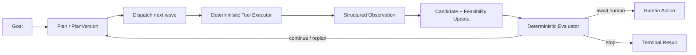
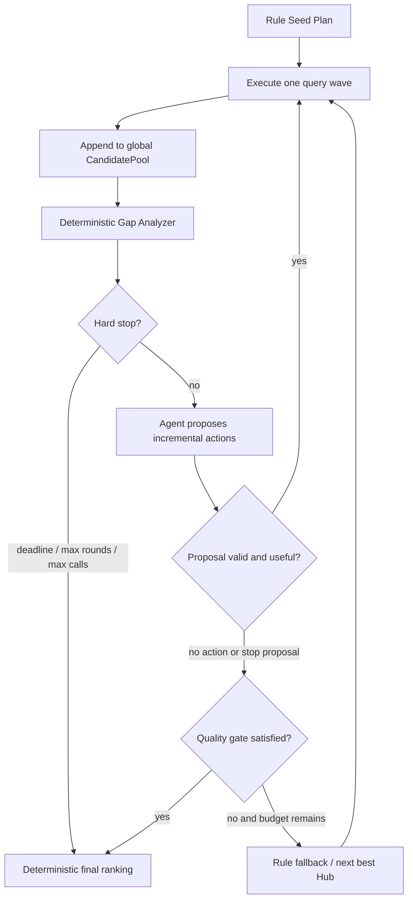

# 项目改造计划

> 执行约定：每次开始任务前先阅读本文件；任务推进后同步更新状态、验证结果、验收证据与未解决风险。  
> 本文件中的 P0–P4 是项目唯一主路线。局部性能优化、缓存或重构不得绕过该优先级。

## 总目标

把当前旅行路线查询工作流建设为一个结果可信、工具稳定、能够规划与重规划、上下文可恢复、运行可评测的工业级 Agent。

优先级遵循：

1. 结果正确且可证明；
2. 工具可靠且可复用；
3. Agent 能根据 Observation 动态决策；
4. 上下文可持久化和恢复；
5. 系统可评测、可观测、可灰度发布。

## 已完成基础工作

- [x] 定义火车与机票工具的统一输入、输出、状态、错误码和指标格式。
- [x] 将现有 12306 查询包装为 `TrainSearchTool`。
- [x] 将现有携程 ReAct 查询包装为 `FlightSearchTool`。
- [x] 增加单次查询、批量查询、请求去重和线程安全 TTL/LRU 内存缓存。
- [x] 将旅行规划图改为依赖领域工具接口，并保留旧参数兼容层。
- [x] 提供 LangChain `search_trains` / `search_flights` 适配器。
- [x] 完成 143 项自动化测试、`compileall` 和补丁格式检查。
- [x] 真实验证成都东到重庆北查询及二次缓存命中。

这些工作属于 P1 的一部分，不代表 P0 正确性闭环或整个 P1 已完成。

## 不可破坏的系统约束

- 不以减少为 1 条推荐换取速度；默认目标仍是 5 条有差异的综合最优路线。
- 不能因为找到直达路线就停止；直达路线只是候选骨架之一。
- 不修改已经验证成功的携程首页导航与 12306 基础行为，除非有独立回归证据。
- 验证码、登录和人工确认必须显式返回 `human_action_required`，禁止无限重试。
- LLM 不得凭空生成票价、班次、时间或可用性；关键事实必须来自工具证据。
- 每个工作项小步提交、独立测试、可单项回退。

---

## P0：先保证结果不会错

### P0.1 修复城市代码和机场代码边界

- [x] 建立城市、机场、火车站三类实体及规范化标识，禁止混用名称、城市代码和机场 IATA。
- [x] 明确 `BJS` 这类城市代码与 `PEK`、`PKX` 机场代码的展开和收敛规则。
- [x] 查询请求保留用户原始地点、规范化城市和实际端点，避免展示与查询端点不一致。
- [x] 对未知代码、同城端点、城市多机场和跨城机场增加边界测试。
- [x] 修复当前可能把同一航班同时标记为不同出发机场的情况。

验收标准：

- 每条结果能明确回答“实际从哪个站/机场出发、到哪个站/机场到达”。
- 不再出现航班证据属于 `PEK`，推荐文本却写成 `PKX` 的情况。

### P0.2 使用绝对日期时间

- [x] 内部统一使用带日期和时区的绝对 `datetime`，不再只依赖 `"20:15"` 一类字符串。
- [x] 正确处理跨日、跨时区、夜间火车和 `(+1d)` 航班。
- [x] 明确用户出发日期约束作用于首段出发，还是每个独立查询段。
- [x] 输出层再格式化为本地时间，计算层禁止丢失日期和时区。

验收标准：

- 跨日等待时间、总行程时间和先后顺序可由绝对时间直接计算。
- 成都到济州岛等跨日路线不产生负等待或日期错位。

### P0.3 增加站到机场接驳

- [x] 建立火车站到机场、机场到机场的地面接驳边。
- [x] 接驳边至少包含预计耗时、缓冲时间、成本、数据来源和可靠性。
- [x] 区分同楼换乘、同机场换乘、同城跨机场、火车站到机场和跨城地面移动。
- [x] 无接驳证据的组合不得被当成可执行路线。

验收标准：

- `成都东→重庆北→CKG` 等路线包含重庆北到江北机场的时间和成本。
- 北京西到 PEK/PKX 的路线分别计算，不再共享一个虚构等待时间。

### P0.4 建立可行性引擎

- [x] 将路线可行性从推荐排序中分离为确定性规则引擎。
- [x] 校验段间地点连通、绝对时间顺序、最短换乘时间、接驳时间和风险缓冲。
- [x] 为国内/国际、同机场/跨机场、火车转飞机定义不同最短衔接规则。
- [x] 输出 `feasible`、`infeasible`、`uncertain` 及结构化原因。
- [x] `infeasible` 路线不得进入最终 Top 5；`uncertain` 必须明确提示风险。

验收标准：

- 所有最终推荐先通过可行性引擎，再进入评分和排序。
- 针对错站、赶不上、跨日和缺少接驳证据建立单元测试。

### P0.5 严格证据溯源

- [ ] 为票价、班次、起终点、时间、接驳和库存分别记录来源。
- [ ] 每项证据包含来源工具、查询参数、抓取时间、原始引用和解析版本。
- [ ] 推荐中的关键字段必须能追溯到对应证据，禁止用一个证据推断另一个机场或日期。
- [ ] 区分实时证据、静态规则、LLM 推断和缺失信息。

验收标准：

- 任意最终路线都能生成字段级 provenance。
- 删除或失效一项关键证据后，路线自动降级为不确定或不可用。

### P0.6 路线骨架去重

- [x] 定义路线骨架：交通方式、实际端点、核心班次和换乘 Hub。
- [x] 同一后半程航班搭配多个时间接近的火车班次时，限制其占用推荐名额。
- [x] 排序后执行多样性选择，兼顾价格、总耗时、等待、换乘数和可靠性。
- [x] 默认返回 5 条不同价值取向的候选；不足 5 条时明确说明。

验收标准：

- Top 5 不会被同一核心航班的轻微变体完全占满。
- 成都到济州岛样例能够区分“最低价”“最短时长”“较低换乘风险”等路线。

### P0 完成门禁

- [ ] 建立至少 4 组黄金正确性样例：国内直达、国际直达、国际中转、火车加飞机。
- [ ] 成都到北京、成都到济州岛必须进入固定回归集。
- [ ] 每个错误样例都有确定的拒绝原因，不依赖 LLM 自由判断。
- [ ] P0 未通过前，不把性能优化后的调度器设为默认。

---

## P1：工程化工具层

### P1 最终要求：形成可复用的领域工具产品

P1 的交付物不是“让当前规划图能调用携程和 12306”，而是两个可以被任意 Agent、CLI、定时任务或服务端复用的领域工具。每个工具必须具备稳定的请求/结果契约、明确的执行上下文、可替换后端、受控的 Runtime、版本化持久缓存和基础集成验收；规划层只能看到公开契约和证据引用，不能接触 Selenium、Cookie、浏览器请求或原始页面。并发治理、回放和工具注册转入补充性能与稳定性计划，不再阻塞 P1 基线验收。

工具的最小公共形态为：

`ToolRequest + ToolExecutionContext -> ToolResult[ToolOutput] + EvidenceRef + ToolMetrics`

- `ToolExecutionContext` 统一携带 deadline、取消信号、追踪标识、调用预算和幂等键。
- `ToolResult` 统一表达成功、空结果、人工操作和结构化错误；错误策略由 Runtime 执行，不由业务图自行猜测。
- `ToolOutput` 只暴露领域模型；原始页面、抓包、Cookie 与会话只通过受控的 trace/evidence 引用保留。

### P1.0 工具契约基线（已完成，后续仅兼容扩展）

- [x] 统一 `FlightSearchTool`、`TrainSearchTool` 的单次/批量调用、领域输入输出、状态和错误码。
- [x] 支持请求去重、线程安全内存缓存、错误封装和 LangChain 公开适配器。
- [x] 规划图只依赖领域工具接口，不直接依赖 12306 实现。
- [x] 已有工具级测试和真实 12306 冒烟验证。
- [ ] 在不破坏现有调用方的前提下引入 `ToolExecutionContext`、`EvidenceRef`、工具/解析 schema 版本和后端标识。

验收标准：

- 旧的 `search()` / `search_many()` 调用保持兼容；新增上下文参数只由 Runtime 注入。
- 任意工具结果可独立序列化，且不泄露浏览器或登录内部状态。

### P1.1 携程后端组件化

- [x] 定义 `CtripNavigator`：只负责把已验证的搜索意图导航到目标页面。
- [x] 定义 `BrowserSessionManager`：只负责创建、租借、归还和销毁浏览器会话；账户、Cookie 与任务会话隔离。
- [x] 定义 `CtripCaptureBackend`：只负责等待并提取 `batchSearch` 原始响应，不解析业务字段。
- [x] 定义 `RawResponseStore`：保存脱敏原始响应、采集时间、来源 URL、schema/解析版本和内容摘要，返回引用而不是把大对象塞入上下文。
- [x] 定义纯 `CtripPayloadParser`：`payload -> ParsedItinerary`，不导入 Selenium、不读取环境变量、不访问网络。
- [x] 定义 `FlightEvidenceMapper`：`ParsedItinerary -> FlightEvidence`，负责地点、时间、价格和证据字段的转换。
- [x] 定义 `CtripFlightBackend` 作为唯一编排器；旧的 `CtripSeleniumWirePageExtractor` 已降为兼容适配层，旧实现已移除。

验收标准：

- 导航、会话、抓包、存储、解析、证据转换均可使用 fake 单独测试和替换。
- `travel_plan_graph.py`、`flight_react.py` 和 LangChain 适配器不导入 Selenium、Cookie 或抓包对象。
- 解析测试只输入已录制 payload，不启动浏览器。

完成证据：

- `CtripFlightBackend` 仅编排导航、会话、抓包和解析/证据组件；`CtripSeleniumWirePageExtractor` 保留旧 `PageExtractor` API 并委托给 Backend。
- `InMemoryRawResponseStore` 保存脱敏响应并生成 `RawResponseRef`；证据只保存 capture 引用和解析版本，不携带原始响应。
- `tests/fixtures/ctrip/batch_search_direct.json` 被纯 Parser/Mapper 测试直接加载，组件测试使用 fake navigator、session manager 和 capture backend，不启动 Selenium。
- 浏览器会话的并发租约、限流、熔断与多任务隔离属于 P1.3，尚未提前标记完成。
- 2026-07-29：完整自动化测试 162 项通过；`compileall` 与 `git diff --check` 通过。

### P1.2 工具 Runtime：超时、取消与重试策略

- [x] 建立 `ToolRuntime`，统一执行单次调用、批量调用、deadline、取消传播、attempt 计数和耗时指标。
- [x] 区分单次后端超时与任务全局 deadline；任务超时后取消未开始请求并安全收集已完成结果。
- [x] 定义唯一的 `RetryPolicy`：仅 `timeout`、`rate_limited`、`tool_unavailable` 可有限重试，并带指数退避、抖动和最大尝试数。
- [x] 明确 `captcha_required`、`login_required`、`invalid_input`、`route_mismatch`、`parse_failed` 不自动重试；必须返回确定性结果或人工操作。
- [x] 让 `ToolMetrics.attempts`、终止原因和退避信息来自 Runtime，而不是各后端自行填充。

验收标准：

- 每种错误码都有“重试/不重试”的单元测试；不允许 ReAct 或规划图绕过 Runtime 直接重试后端。
- deadline、取消和部分成功都能在批量测试中复现。

完成证据：

- `ToolExecutionContext` 以绝对单调时钟 deadline 传递批次共享预算，并携带取消事件、trace 与幂等键；同步后端不能被强杀，但 Runtime 会阻止取消/超时后的未开始调用与重试。
- `CachedTrainSearchTool` 和 `CachedFlightSearchTool` 均通过 `ToolRuntime` 执行后端调用；机票批次先保留首轮成功项，只对允许重试的失败项发起单项重试。
- `RetryPolicy` 对所有错误码的可重试性使用显式白名单；`tests/test_tool_runtime.py` 覆盖超时退避、验证码不重试、取消、deadline 后部分成功以及混合机票批次。
- 2026-07-29：完整自动化测试 177 项通过；`compileall` 与 `git diff --check` 通过。

### P1.4 版本化持久缓存

- [x] 定义 `ToolCache` 抽象，保留内存 L1，并实现 SQLite L2。
- [x] 缓存键包含工具名、规范化请求、后端版本、解析版本、输出 schema 版本和必要的账户/区域隔离维度。
- [x] 成功结果与空结果使用不同 TTL；错误、验证码、登录和取消结果永不持久化。
- [x] 支持 TTL 清理、容量上限、schema 失效、迁移和显式清理命令。
- [x] CLI 重启后安全命中可用缓存，版本变化后自动 miss。

验收标准：

- 冷启动、热缓存、重启后缓存、版本失效和错误不缓存均有自动化测试。
- 缓存记录不保存明文密码、完整 Cookie 或未脱敏页面。

完成证据：

- `SqliteToolCache` 以 SQLite 作为 L2、`InMemoryToolCache` 作为 L1；缓存键仅保存哈希，但哈希输入包含工具名、规范化请求、后端/解析/输出版本和 scope。
- 机票持久化结果只保存领域 `FlightOption` 与经过字段脱敏的证据；`raw_state`、Cookie、Token、会话字段和 URL 查询参数不落盘。
- 成功与空结果分别使用 `FLIGHT_WATCH_TOOL_CACHE_TTL_SECONDS` 和 `FLIGHT_WATCH_TOOL_CACHE_NO_RESULT_TTL_SECONDS`；`clear-cache` 命令可清理配置的 SQLite 缓存。
- `tests/test_persistent_tool_cache.py` 覆盖冷/热与重启后命中、版本失效、空结果 TTL、敏感数据不落盘及错误/人工操作不缓存。
- 2026-07-29：P1.0–P1.4 门槛测试 39 项通过；完整自动化测试 185 项通过；`compileall`、`git diff --check` 及实际 `flight-watch clear-cache` 命令通过。

### P1.7 集成验收与发布门禁

- [x] 组件契约测试：导航、抓包、解析、证据转换可分别替换和测试。
- [x] Runtime 策略测试：每种错误码都有确定的重试或不重试测试。
- [x] 缓存测试：重启 CLI 后可安全命中版本化 SQLite 缓存。
- [x] P1 基线验收：公开 API 兼容、部分失败批量、组件边界、Runtime 与持久缓存均通过离线自动化门槛。

阶段性验收证据（P1.0–P1.2，非完整发布门禁）：

- `tests/test_p1_foundation_gates.py` 验证规划图、ReAct 和领域工具层不直接导入 Selenium/Cookie 实现，并验证 LangChain 公开输出可序列化且不泄露后端原始状态。
- `scripts/verify_p1_foundation.ps1` 统一运行携程组件、Runtime、领域工具和基础集成门槛；在 Windows 上使用 `powershell -NoProfile -ExecutionPolicy Bypass -File .\scripts\verify_p1_foundation.ps1` 执行，不修改系统执行策略。
- P1.3 并发治理、P1.5 回放、P1.6 工具注册和真实外部环境冒烟已转入补充计划；它们不阻塞 P1 基线，但上线到高并发或无人值守场景前必须补齐。

### P1 基线验收（完成）

- [x] P1.0–P1.2 的工具契约、携程组件边界和 Runtime 已通过独立门槛。
- [x] P1.4 的 SQLite L2 / 内存 L1、版本失效、差异 TTL、敏感结果排除和 CLI 清理已通过自动化与实际 CLI 验证。
- [x] 当前 P1 基线已验收；字段级 EvidenceRef 与更完整的 schema 溯源仍随 P0.5 严格证据溯源推进。

### P1 实施顺序

1. P1.0 补齐执行上下文和版本字段；
2. P1.1 拆开携程单体并用兼容适配层平滑迁移；
3. P1.2 建立统一 Runtime，再将两个工具接入；
4. P1.4 实现 SQLite 缓存；
5. P1.7 完成 P1.0–P1.4 的离线基础门槛。

### 补充性能与稳定性计划（不阻塞 P1 基线）

#### S1：后端治理（原 P1.3）

- [ ] 为携程、12306 设置独立并发、队列上限、速率限制、熔断和半开探测。
- [ ] 将浏览器会话按任务/租约隔离，记录队列等待、限流、熔断与资源释放。

#### S2：脱敏录制与回放（原 P1.5）

- [ ] 建立最小脱敏录制样本与 `ReplayCaptureBackend`，固定携程解析回归。

#### S3：批量语义与工具注册（原 P1.6）

- [ ] 建立 `ToolRegistry`，使 CLI、规划图和 LangChain 通过工厂切换 live/fake/replay 后端。
- [ ] 把混合批次顺序、去重、单项失败隔离作为注册工具的统一契约。

---

## P2：形成真正的 Agent 循环

### P2 目标与判定标准

P2 的目标不是“再增加一个 LLM 节点”，而是形成可控制的闭环：

必须同时满足以下条件，才称为真正的 Agent 循环：

- Plan 是可版本化、可校验、可比较差异的结构化对象，不是日志文本。
- 每次工具执行都产生 Observation；Planner 不能直接读取 Selenium、Cookie 或大段原始状态。
- Evaluator 能依据新 Observation 选择继续、Replan、请求人工操作或停止。
- 图中存在受预算保护的条件回边；不存在无新信息的空转循环。
- LLM 只提出受约束的搜索策略和 Hub 候选；Executor、可行性、预算、停止条件和事实写入均为确定性代码。

当前差距：现有 `travel_plan_graph.py` 是固定一次性 DAG；`QueryPlan` 一次生成并全部执行，`QueryBudget` 只限制建计划数量，没有运行时账本；结果主要进入 options/warnings，没有统一 Observation；直达预取、Hub 生成和排序均不会触发第二轮计划。

### P2 核心策略：确定性基线 + Agent 增量探索

采用“双层控制”而不是让 Agent 从零决定全部查询：

1. **确定性 Seed Planner** 根据用户目标、区域、可用交通方式、显式 Hub、机场/车站索引和静态接驳规则，生成第一轮低风险基线查询；
2. **确定性 Executor** 执行查询，将 ToolResult 转成 Observation，并将可用结果增量写入全局 `CandidatePool`；
3. **确定性 Gap Analyzer** 计算当前结果缺口：数量不足、骨架单一、价格偏高、耗时偏长、换乘风险高、证据不足或某类路线尚未覆盖；
4. **Agent Planner** 只根据 Gap、剩余预算、未查询 Hub 和最近 Observation，提出下一轮增量查询；
5. **PlanValidator** 对 Agent 提案执行地点、预算、重复请求、硬约束、工具能力和预期收益校验；
6. 重复“增量查询 → Observation → Gap → Agent 提案”，直到硬预算耗尽，或 Agent 提议结束且确定性 Evaluator 同意；
7. 最终由确定性的可行性、去重、多样性和排序模块，在整个 CandidatePool 中选择预算范围内观察到的最佳 Top 5。

关键补充和修正：

- “查询重试”必须拆成两个概念：
  - **Tool attempt**：同一请求因 timeout/rate limit/unavailable 进行有限重试，由 P1 `ToolRuntime` 管理；
  - **Agent round**：依据新 Observation 提出不同查询或不同 Hub，是语义级探索，由 `ExecutionBudget.max_rounds` 管理。
- Agent 不能通过 Replan 原样重复同一失败请求；除非有人工恢复、后端切换、约束变化或新的语义请求。
- Agent 的“我认为可以结束”只是 `stop proposal`，不能直接结束运行；RuleEvaluator 仍需检查候选数量、可行性、多样性、未搜索收益和关键错误。
- 硬停止条件始终高于 Agent 意愿：deadline、最大轮数、最大唯一工具调用、最大 Hub 和人工操作状态达到后必须停止或中断。
- 最终结果不能表述为未知搜索空间中的“全局最优”，应定义为：**在给定预算、已验证证据和已执行查询范围内的综合最优结果**。
- Agent 不直接挑选最终航班或修改评分。Agent 决定“还值得查什么”，确定性排序器决定“已查结果中什么最好”。

#### 第一轮基线查询建议

Seed Planner 默认只建立一小批高确定性查询：

- 直达飞机；
- 国内两端可通铁路时的直达火车；
- 用户明确指定的 Hub；
- 规则评分最高的少量 Hub（`balanced` 初始建议 2–3 个）；
- 每个 Hub 只生成组成一条路线骨架所需的最小查询集合。

第一轮不一次性展开全部候选 Hub。这样即使后续 Agent 失效，系统仍能返回基线结果；Agent 的价值体现在补充搜索，而不是承担基础正确性。

#### Agent 可提出的动作白名单

- `expand_hubs`：从未查询 Hub 池选择下一批；
- `query_route_skeleton`：补足某一种缺失路线骨架；
- `query_alternative_endpoint`：在城市多机场边界内查询另一个合法机场；
- `relax_soft_preference`：放宽时间偏好、价格软阈值等软约束；
- `request_human_action`：处理验证码或登录；
- `stop_proposal`：说明继续查询的边际收益已经较低。

Agent 不得：

- 放宽用户硬约束、地点边界或可行性规则；
- 生成不存在的票价、班次、时刻和库存；
- 直接调用未注册工具；
- 绕过幂等键、预算、缓存和 PlanValidator；
- 删除已收集的有效候选或把不可行路线升级为可行。

#### 全局 CandidatePool

所有轮次共享一个只增量更新的候选池：

- 按规范化路线骨架、实际端点、核心班次和证据引用去重；
- 每条候选记录首次发现轮次、最后更新轮次、来源 Observation、可行性和 value profiles；
- 新结果可以补充同一候选的证据或价格，但不能无记录地覆盖历史值；
- 每轮重新计算可行性、支配关系和 Top 5 摘要，供 Gap Analyzer 和 Agent 使用；
- 最终排序只读取通过证据和可行性门禁的候选。

#### 联合停止协议

运行结束需要满足以下任一条件：

1. **硬预算停止**：deadline、最大 Agent round、最大唯一工具调用或最大 Hub 已耗尽；
2. **质量完成**：已有足够差异化可行候选，未搜索 Hub 的收益上界不足以显著改善当前 Top 5；
3. **联合结束**：Agent 提出 `stop_proposal`，且 RuleEvaluator 验证候选质量、边际收益和未解决错误均达标；
4. **无合法动作**：Agent 提案全部无效，RulePlanner 也找不到尚未执行且有正收益的动作；
5. **人工中断**：关键路径遇到 captcha/login，返回 `human_action_required`；
6. **失败**：无可用候选且没有可恢复动作。

若预算耗尽但已有可用候选，返回 `partial_success` 或 `budget_exhausted`，并继续从 CandidatePool 输出当前最佳结果；不得丢弃前几轮成果。

### P2.0 迁移基线与安全开关

- [ ] 固定当前旧图作为 `legacy` 基线，保存成都→北京、成都→济州岛及国内/国际样例的候选、工具调用数、Hub 数、耗时和终止状态。
- [ ] 增加 `legacy | shadow | agent` 三种运行模式；默认保持 `legacy`，未通过门禁前不得删除旧图。
- [ ] `shadow` 模式只生成 Plan/Observation/Decision 轨迹并复用已有工具结果，不重复访问携程或 12306。
- [ ] 为每次运行生成稳定 `run_id`，为每轮生成 `round_id`，为每次计划生成递增 `plan_version`。

验收标准：

- 开启 P2 开发不会改变默认 CLI 的当前推荐结果和工具调用行为。
- 新旧路径可在同一批 fake 工具数据上做候选、调用数和终止原因对比。

### P2.1 Agent 状态契约与显式 Plan

新增独立模块 `agent_loop_models.py`，至少包含：

- `AgentGoal`：规范化意图、硬约束、软偏好、目标候选数、探索模式。
- `ExecutionBudget`：绝对 deadline、最大轮数、最大 Hub 数、最大唯一工具调用数、最大 LLM 调用/token 预算。
- `BudgetLedger`：已消耗轮数、工具调用、唯一请求、缓存命中、LLM 调用、耗时和剩余预算。
- `AgentPlan`：`plan_id`、`version`、`created_from_observation_ids`、计划理由、当前 wave、待执行步骤和预期收益。
- `PlanStep`：稳定 `step_id`、工具、规范化请求、策略、Hub、依赖、优先级、预计成本、幂等键和状态。
- `AgentRunState`：Goal、当前 Plan、历史 Plan 摘要、Observation 索引、候选摘要、预算账本、终止状态。

实施要求：

- [ ] 先定义 `Planner` 协议和确定性的 `RulePlanner`，将现有 `select_strategies`、Hub 生成和 `build_query_plan` 包装为第一版 Plan。
- [ ] Plan 在执行前由 `PlanValidator` 校验：端点、日期、依赖、重复请求、预算、工具能力和 Hub 合法性。
- [ ] 请求签名与 `PlanStep.idempotency_key` 使用规范化请求生成；同一事实查询跨 Plan 版本只执行一次。
- [ ] 历史 Plan 只保留结构化摘要和 diff，不把完整旧计划重复塞入 LLM 上下文。

验收标准：

- 相同 Goal 和上下文生成的 Rule Plan 可复现；Plan 可 JSON 序列化。
- 非法机场、循环依赖、越过预算、重复步骤和不可执行策略在调用工具前被拒绝。
- 第一版 Rule Plan 在相同 fake 数据上与旧 `QueryPlan` 的查询语义等价。

### P2.2 循环骨架与确定性 Executor

- [ ] 将固定 DAG 拆为 `initialize → plan → dispatch_wave → execute_tools → observe → update_candidates → evaluate → conditional_route`。
- [ ] Executor 每轮只执行当前 wave 的 `ready` 步骤，不一次性执行全部 Hub；依赖未满足的步骤保持 pending。
- [ ] Executor 只能通过 P1 的 `FlightSearchTool` / `TrainSearchTool` 和 `ToolExecutionContext` 调用外部能力。
- [ ] Runtime 负责传输级 retry；Agent 不得以 Replan 名义原样重试同一请求。重新执行必须有新的语义条件、后端切换或人工恢复事件。
- [ ] 工具结果、候选、证据和 warnings 使用增量合并，禁止每轮覆盖上一轮已验证结果。

验收标准：

- 使用静态 RulePlanner 且只运行一轮时，新循环与旧图候选结果等价。
- 重复 PlanStep 不产生第二次后端调用；缓存命中计入账本但不计为新的外部调用。
- 单项失败不会丢失同轮其他成功结果。

### P2.3 结构化 Observation

新增 `AgentObservation`，每次 PlanStep 完成后生成，至少包含：

- `observation_id/run_id/round_id/plan_version/step_id`；
- 工具状态、结构化错误、attempts、latency、cache_hit、终止原因；
- 结果数量、规范化实际端点、价格/时刻摘要和 EvidenceRef；
- 新增/移除候选数、可行/不确定/不可行数量、路线骨架增量；
- 本次预算消耗、剩余预算和 `suggested_actions`；
- `content_hash`，用于检测是否真的产生新信息。

实施要求：

- [ ] 使用确定性的 `ObservationBuilder` 将 `ToolResult` 转为 Observation；禁止 LLM 改写工具事实。
- [ ] 原始 `raw_state`、页面和抓包只保留受控引用；Observation 只保存决策所需摘要。
- [ ] warnings 从自由字符串逐步收敛为 `reason_code + details`，至少覆盖 timeout、captcha、login、no_results、route_mismatch、parse_failed。
- [ ] Observation 只追加不修改；候选状态由 reducer 根据 Observation 重建或增量更新。

验收标准：

- 每个已执行步骤恰好对应一个 Observation；失败和人工操作也必须产生 Observation。
- 相同工具结果生成相同 `content_hash`；没有新 hash 时禁止 Replan。
- 从 Observation 可以解释某条候选为何新增、被拒绝或降级为 uncertain。

### P2.4 Evaluator 与 Replan 协议

定义 `AgentDecision`：

- `action`: `continue | replan | await_human | stop`；
- `reason_codes`：结构化触发原因；
- `next_wave` 或 `plan_patch`；
- `terminal_status`: `completed | partial_success | human_action_required | budget_exhausted | failed`；
- `based_on_observation_ids`，保证决定有新证据来源。

优先实现确定性 `RuleEvaluator`：

- [ ] 直达成功但候选不足 5 条或路线骨架单一时继续探索，不能直接停止。
- [ ] 某 Hub 无结果、路线不可行或高度重复时降低其收益，并选择尚未查询的替代 Hub。
- [ ] `captcha_required/login_required` 转 `await_human`；不得自动扩展大量 Hub 规避人工状态。
- [ ] `timeout/tool_unavailable` 只有在 Runtime 重试耗尽后才能进入 Agent 决策；Evaluator 决定降级、换后端或以 partial 结束。
- [ ] Replan 必须生成 `PlanDiff`：新增、取消、保留步骤及每项理由；已完成步骤不可被重新计划。
- [ ] 禁止无新 Observation、相同 Plan hash 或超过最大轮数的 Replan。

验收标准：

- 同一状态下 Evaluator 决策可复现，关键停止/继续判断不依赖 LLM 自由文本。
- 轨迹中每次 Replan 都能追溯到 Observation 和 PlanDiff。
- 验证码不会形成自动循环；连续空结果不会无限扩 Hub。

### P2.5 动态 Hub 分波扩展

将当前一次性 Hub 列表改为 `HubCandidatePool`：

- `unseen`：未查询；
- `scheduled`：已进入 Plan；
- `observed`：已有结果；
- `exhausted`：无继续价值；
- `blocked`：工具/地点/接驳条件不满足。

Hub 收益分由确定性特征组成：机场航班潜力、与两端连通性、火车站到机场接驳、路线骨架新颖度、预计查询复用、历史本轮产出、价格/时间改善上界和工具成本。LLM 只能补充候选及理由，不能直接覆盖规则分数或绕过地点校验。

- [ ] Wave 0 查询直达与用户显式 Hub；Wave 1 查询最高收益 Top-K；后续 wave 根据 Observation 再扩展。
- [ ] 相同后半程航班、相同规范化请求和同城多机场查询跨 Hub 复用，不重复调用工具。
- [ ] Hub 无新候选、只产生不可行路线或只产生已存在骨架时，下调后续相似 Hub 收益。
- [ ] 支持 `fast | balanced | exhaustive` 探索配置，配置只影响预算和 wave 宽度，不改变可行性规则。

初始建议配置（需要用真实基线校准）：

| 模式 | 最大轮数 | 最大 Hub | 最大唯一工具调用 | 总 deadline | 用途 |
|---|---:|---:|---:|---:|---|
| `fast` | 2 | 3 | 8 | 120s | 快速初筛 |
| `balanced` | 3 | 8 | 20 | 240s | 默认综合推荐 |
| `exhaustive` | 5 | 20 | 50 | 600s | 召回率对照 |

验收标准：

- 成都→济州岛先查询直达与少量高收益 Hub，不再开局一次性执行几十个 Hub。
- 若首轮只有重庆同航班的多个火车变体，下一轮会寻找不同路线骨架，而不是继续堆同类变体。
- 用户显式指定 Hub 时优先查询，但仍必须通过地点、接驳和预算校验。

### P2.6 停止条件与预算账本

每个节点进入前后都检查同一份 `BudgetLedger`。停止判定按以下优先级执行：

1. `human_action_required`：关键工具等待人工操作；
2. `budget_exhausted`：deadline、轮数、Hub、工具或 LLM 预算耗尽；
3. `completed`：候选数量、可行性、多样性和边际收益全部达标；
4. `partial_success`：有可用候选，但继续探索预期收益不足或关键工具降级；
5. `failed`：没有可用候选且没有合法后续动作。

完成条件不能只看候选数量，必须同时满足：

- 至少 5 条可行且差异化候选，或已证明候选池不足 5 条；
- 覆盖至少两种路线骨架/价值取向，或未搜索 Hub 收益上界无法击败当前结果；
- 没有尚未处理的关键人工操作或可恢复错误；
- 最近一轮对 Top 5 的价格、时长、风险或骨架覆盖没有达到最小改善阈值。

- [ ] 每次 Plan 前预留本轮预算，执行后按实际消耗结算，取消步骤释放未消费预算。
- [ ] deadline 使用单调时钟绝对时间，并传入所有 ToolExecutionContext。
- [ ] 达到预算时保留现有可行候选，返回明确的 `budget_exhausted` 或 `partial_success`，而非空结果。
- [ ] 输出附带 rounds、Hub、唯一调用、缓存命中、终止原因和未执行高收益动作摘要。

验收标准：

- 任意 fake 工具行为下都能在有限轮数内终止。
- 找到一条直达路线不会提前停止；已有 5 条同骨架变体也不会被误判为完成。
- deadline 到期后不再启动新步骤，已完成候选仍能正常返回。

### P2.7 受约束的 LLM Planner

在 RulePlanner/RuleEvaluator 闭环稳定后再接入 LLM：

- [ ] LLM 输入只包含 Goal、当前候选摘要、未解决 reason codes、Hub 池 Top-N、预算余量和最近 Observation 摘要。
- [ ] LLM 使用严格 schema 输出 `PlanProposal` 或 `HubProposal`；所有提案必须经过 PlanValidator 和地点/预算校验。
- [ ] LLM 不生成票价、班次、时间、机场事实、工具成功状态或停止结论；这些字段只能来自工具与确定性 Evaluator。
- [ ] LLM 调用失败、格式错误或超预算时自动回退 RulePlanner，不能导致整个任务失败。
- [ ] 记录 LLM proposal 与最终被接受/拒绝的差异，用于后续轨迹评测。

验收标准：

- 关闭 LLM 时 Agent 仍能完整运行并正确终止。
- LLM 提出未知机场、重复 Hub 或越界步骤时会被确定性拒绝。
- LLM 只改善探索策略，不改变工具事实和可行性结论。

### P2.8 轨迹测试、对照与启用门禁

建立 fake 工具驱动的轨迹测试集：

- [ ] 直达足够优但仍需多样性验证；
- [ ] 直达无结果后扩展一个有效 Hub；
- [ ] 首轮 Hub 全部无结果后停止；
- [ ] timeout、tool_unavailable、captcha、login 和部分成功；
- [ ] 五条候选属于同一骨架时继续探索；
- [ ] 第二轮产生更低价/更短时长/更低风险候选；
- [ ] deadline、工具调用、Hub、轮数和 LLM 预算分别耗尽；
- [ ] 重复 Observation、重复 Plan、非法 Plan 和无新信息循环被拒绝。

分阶段启用：

1. `models-only`：只增加状态模型、校验器和单元测试；
2. `shadow`：复用旧图结果生成 Observation/Decision，不影响用户输出；
3. `agent-rule`：RulePlanner + RuleEvaluator 在 fake/回归数据上闭环；
4. `agent-llm`：仅开放受约束的 Hub/策略提案；
5. 默认切换：新循环正确性不低于 legacy，Top 5 多样性不下降，且 `balanced` 冷缓存 P95 达到校准后的门槛。

P2 完成门禁：

- [ ] 成都→北京、成都→济州岛以及 P0 黄金样例的新旧结果完成 A/B；不可行路线不得新增。
- [ ] 所有 Agent 轨迹有限终止，每次决策可追溯到 Plan、Observation、预算和 reason code。
- [ ] `balanced` 不通过减少到 1 条推荐换取速度；目标仍为 5 条综合性价比高且差异化的路线。
- [ ] P0.5 字段级证据溯源未完成前，P2 可开发和 shadow，但不得作为生产默认路径。

### P2 推荐实施顺序

1. 先做 P2.0 与 P2.1：状态契约、PlanValidator、RulePlanner 和 legacy 基线，不改图行为；
2. 做 P2.3：把现有 ToolResult 和候选变化转为 Observation；
3. 做 P2.2：用 RulePlanner 搭起单轮循环并验证与旧图等价；
4. 做 P2.6：预算账本和有限终止先于 Replan；
5. 做 P2.4：加入 RuleEvaluator 与 PlanDiff；
6. 做 P2.5：将 Hub 改成分波动态扩展；
7. 最后做 P2.7：接入受约束 LLM Planner；
8. 通过 P2.8 shadow/A-B 门禁后再考虑切换默认路径。

### P2 第一实施批次：P2.0 + P2.1

第一批只建立控制面，不改动当前工具实现、候选组合、可行性、排序和用户输出。建议拆成以下独立提交：

#### M1.1 固定 legacy 基线

- [ ] 新增 `tests/fixtures/agent_loop/`，保存 fake 工具输入与期望的 QueryPlan、唯一请求签名、候选骨架和终止摘要，不保存实时票价快照。
- [ ] 为成都→北京、成都→济州岛、国内无直达、国际 Hub 中转各建立至少一个确定性基线。
- [ ] 建立 `LegacyRunSummary`，输出计划查询数、唯一请求数、缓存命中、候选数、可行性分布和 Top 5 骨架。

Definition of Done：

- 现有 `build_travel_plan_graph()` 输出不变；
- fixture 全部使用 fake 工具，测试不访问网络、浏览器或 LLM；
- 相同 fixture 连续运行结果一致。

#### M1.2 建立 Agent 状态模型

- [ ] 新增 `src/flight_watch_agent/agent_loop_models.py`，只包含不可变领域模型和枚举，不导入 LangGraph、Selenium、具体工具后端或 LLM。
- [ ] 所有时间使用带时区绝对 `datetime` 或单调时钟预算；所有 ID、状态和 reason code 使用明确类型。
- [ ] 提供显式 `to_dict()/from_dict()` 或统一 codec，保证 Plan、Observation、Decision 和 BudgetLedger 可 JSON round-trip。
- [ ] 为 schema 增加 `schema_version`，不使用 pickle 保存 Agent 状态。

Definition of Done：

- 模型 round-trip 后内容和 hash 不变；
- 非法状态、负预算、无依赖目标、未知动作和 naive datetime 在构造时失败；
- 模型层无外部副作用。

#### M1.3 Plan 签名与校验器

- [ ] 新增 `src/flight_watch_agent/agent_loop_validation.py`。
- [ ] 统一生成 `request_signature`、`step_id`、`plan_hash` 和 `idempotency_key`；哈希输入包含规范化端点、日期、模式、约束和工具 schema 版本。
- [ ] 使用拓扑排序检测依赖环；校验依赖引用存在、步骤状态合法、预算未越界、同一事实请求未重复安排。
- [ ] 输出结构化 `PlanValidationResult`，包含 error/warning reason codes，不以异常字符串作为正常业务结果。

Definition of Done：

- 对输入顺序不敏感的同一 Plan 产生稳定 hash；
- 重复请求、循环依赖、非法 Hub、越界预算均有单元测试；
- 校验失败时 Executor 不会被调用。

#### M1.4 RulePlanner 兼容适配

- [ ] 新增 `src/flight_watch_agent/agent_loop_planner.py`，定义 `Planner` 协议与 `RulePlanner`。
- [ ] RulePlanner 复用现有 `classify_region`、`select_strategies`、`generate_candidate_hubs`、`build_query_plan`，不复制一套路线规则。
- [ ] 将 `QueryPlanItem` 映射为 `PlanStep`，保留 strategy、leg、Hub 和查询请求之间的确定对应关系。
- [ ] 第一版 Plan 只生成一个 wave，用于证明新 Plan 契约与 legacy 查询语义一致。

Definition of Done：

- legacy QueryPlan 与 RulePlanner Plan 的规范化请求集合一致；
- 旧逻辑改动后，兼容测试能发现映射漂移；
- RulePlanner 不调用工具或 LLM。

#### M1.5 运行模式与 shadow 接线

- [ ] 增加 `FLIGHT_WATCH_AGENT_LOOP_MODE=legacy|shadow|agent`，非法值启动时失败，默认 `legacy`。
- [ ] `shadow` 从 legacy 已产生的 ToolResult/候选构建 Plan 和轨迹摘要，不重复执行工具。
- [ ] `agent` 在 M1 阶段保持不可用并返回明确配置错误，直到 P2.2 循环骨架完成。
- [ ] CLI 调试输出可选展示 `run_id/plan_version/plan_hash/validation/decision`，普通输出保持不变。

Definition of Done：

- legacy 与 shadow 的外部工具调用次数完全一致；
- shadow 异常只写 warning，不影响 legacy 最终答案；
- 默认配置和现有 CLI 回归测试全部不变。

#### M1.6 第一批测试门禁

- [ ] `test_agent_loop_models.py`：模型校验、JSON round-trip、hash 稳定性。
- [ ] `test_agent_plan_validation.py`：重复、越界、依赖环、非法状态和 schema 版本。
- [ ] `test_rule_planner_compatibility.py`：新旧计划规范化请求集合等价。
- [ ] `test_agent_shadow_mode.py`：不增加工具调用、不改变最终推荐、轨迹可生成。
- [ ] 全量测试、`compileall`、`git diff --check` 通过。

第一批明确不做：

- 不增加 LangGraph 条件回边；
- 不做动态 Hub 扩展；
- 不让 LLM 生成计划；
- 不修改携程/12306 查询行为；
- 不切换默认 CLI 路径。

### P2 后续提交拆分

| 提交批次 | 核心交付物 | 行为变化 | 回滚单位 |
|---|---|---|---|
| M1 | 状态模型、PlanValidator、RulePlanner、shadow | 默认无变化 | 关闭 shadow/删除新模块 |
| M2 | ObservationBuilder、reason codes、增量 reducer | 仅新增轨迹 | 关闭 Observation 接线 |
| M3 | 单轮 Agent 图、BudgetLedger | 可选 `agent-rule` 单轮 | 切回 legacy |
| M4 | RuleEvaluator、PlanDiff、有限回边 | agent 模式支持 Replan | 禁用 conditional edge |
| M5 | HubCandidatePool、分 wave 扩展 | 减少一次性查询 | 切回静态 Hub 计划 |
| M6 | 受约束 LLM proposal | 改善探索策略 | 回退 RulePlanner |
| M7 | shadow/A-B 门禁与默认切换 | 默认进入 Agent 循环 | 配置切回 legacy |

---

## P3：上下文和持久化

### P3.1 四层上下文

- [ ] `Goal Context`：用户目标、硬约束、软偏好和验收条件。
- [ ] `Working Context`：当前 Plan、预算、待执行动作和候选摘要。
- [ ] `Evidence Context`：结构化证据、来源、有效期和可信度。
- [ ] `Event Context`：工具调用、Observation、Replan、错误和人工操作事件。

### P3.2 Checkpoint 与恢复

- [ ] 在关键节点持久化 checkpoint，包含状态模式版本。
- [ ] 支持验证码处理后继续、进程重启后恢复和失败任务重放。
- [ ] 外部副作用和工具调用使用幂等键，恢复时避免重复执行。

### P3.3 上下文压缩

- [ ] 对重复工具结果、历史计划和长证据做确定性去重与摘要。
- [ ] LLM 上下文只保留当前决策必要内容，完整数据存储在 Evidence/Event 层。
- [ ] 压缩前后保留事实一致性测试。

### P3 完成门禁

- [ ] 中断任务可从最近 checkpoint 恢复。
- [ ] 同一工具结果不重复进入 LLM 上下文。
- [ ] 任意决策可回放到对应 Goal、Plan、Observation 和 Evidence。

---

## P4：评测与生产部署

### P4.1 黄金测试集与轨迹评测

- [ ] 建立覆盖正常、无结果、跨日、错站、超时、验证码、登录和部分成功的黄金测试集。
- [ ] 同时评测最终答案、路线可行性、工具选择、Replan 合理性和停止时机。
- [ ] 新旧调度器进行 A/B 对比，未达到门禁不得删除旧实现。

### P4.2 线上可观测性

- [ ] 为每次运行生成 `run_id` 和结构化 trace。
- [ ] 监控成功率、P50/P95 总耗时、工具延迟、调用数、缓存命中率、LLM 成本和人工介入率。
- [ ] 能定位时间消耗发生在哪个 Plan、Hub、工具或重试。

### P4.3 灰度、降级与发布

- [ ] 支持按配置灰度启用新 Planner、工具或停止策略。
- [ ] 携程异常时支持缓存结果、部分结果或备用数据源降级。
- [ ] 定义发布门禁、回滚条件和数据兼容策略。

### P4 完成门禁

- [ ] 正确性、轨迹质量、延迟和成本均达到门禁。
- [ ] 线上异常能够观测、告警、降级和回滚。

---

## 推荐实施顺序

### P0：先保证结果不会错

1. 修复城市代码和机场代码边界。
2. 使用绝对日期时间。
3. 增加站到机场接驳。
4. 建立可行性引擎。
5. 严格证据溯源。
6. 路线骨架去重。

### P1：工程化工具层

1. 统一 Tool 接口和错误码。
2. 拆分携程导航、抓包、解析。
3. 增加缓存、超时、熔断、会话隔离。
4. 建立工具级测试和录制回放。

### P2：真正的 Agent 循环

1. 引入显式 Plan。
2. 查询后生成 Observation。
3. 支持 Replan。
4. 使用动态 Hub 扩展。
5. 定义停止条件和执行预算。

### P3：上下文和持久化

1. Goal/Working/Evidence/Event 四层上下文。
2. Checkpoint 持久化。
3. 上下文压缩。
4. 任务恢复和运行回放。

### P4：评测与生产部署

1. 黄金测试集。
2. Agent 轨迹评测。
3. 线上 tracing。
4. 成本与延迟监控。
5. 灰度发布与工具降级。

## P0.1–P0.4 完成证据

- `PlaceRef` 使用 `city:*`、`airport:*`、`station:*` 规范化标识；查询语义和实际证据端点分离。
- `BJS` 查询可接受 `PEK/PKX`，明确 `PEK` 时拒绝 `PKX`；`SHH` 火车站电报码与同名 IATA 通过上下文解析。
- 公共机票请求拒绝未知代码和同城飞行端点，机票输出包含原始请求地点和实际机场。
- 携程本地时间按机场时区解析；火车提供带日期和中国时区的 `departure_at/arrival_at`。
- `RouteEdge` 的运行时间字段只接受 `datetime`；用户日期定义为首段本地出发日期。
- 地面接驳支持同航站楼、同机场换楼、同城跨机场、站到机场、机场到站和跨城拒绝。
- 重庆北到 CKG、北京西到 PEK/PKX、PEK 到 PKX 有独立接驳数据；价格、耗时、缓冲、来源和可靠性进入路线边。
- 无接驳证据的跨城组合不会生成候选路线。
- `RouteFeasibilityEngine` 独立于排序器，统一返回 `feasible`、`infeasible`、`uncertain` 和结构化原因。
- 规划图在 `build_candidate_routes` 与 `rank_routes` 之间执行可行性节点；不可行路线保留在拒绝集合中，但不会交给排序器或进入 Top 5。
- 换乘策略分别覆盖国内/国际、同航站楼/同机场/跨机场、火车转飞机、飞机转火车和火车转火车，并把地面耗时与风险缓冲计入必需时间。
- 单元测试覆盖错站/跨城、赶不上、跨日、缺少接驳、缺少时间、无时区时间、反向时间以及不确定风险展示。
- 2026-07-28：完整自动化测试 152 项通过；`compileall` 与 `git diff --check` 通过。

## P0.6 完成证据

- `RouteSkeleton` 由交通方式序列、证据中的实际端点、核心火车/航班班次和换乘 Hub 共同构成；完全相同骨架只保留排序靠前者。
- 同一后半程航班即使搭配多个相近火车班次，默认最多占两个 Top 5 名额；不会再由同一核心航班的轻微变体占满推荐。
- 排序后执行独立的确定性多样性节点，综合价格、总耗时、等待、换乘数、可行性状态、连接余量和证据置信度。
- 推荐结果标记 `best_overall`、`lowest_price`、`shortest_duration`、`lower_transfer_risk`、`shortest_wait` 或 `balanced_alternative`；不足 5 条时输出实际差异化候选数。
- 成都到济州岛回归样例覆盖重庆同航班多火车变体、北京/广州/上海替代骨架以及最低价、最短时长和较低风险取向。
- 2026-07-29：完整自动化测试 157 项通过；`compileall` 与 `git diff --check` 通过。

## 当前执行点

P1 工具层基线已验收，P2 Agent 循环计划已完成细分。若开始实施 P2，下一工作项是 **P2.0 迁移基线与安全开关 + P2.1 Agent 状态契约与显式 Plan**，先保持默认 legacy 路径不变。

P0.5 字段级严格证据溯源仍未完成：它不阻塞 P2 的模型、shadow 和 fake 工具闭环开发，但在 P0.5 完成前，P2 Agent 路径不得切换为生产默认。

## 当前风险

- 携程页面和验证码属于外部不确定性，必须与普通无结果区分。
- 当前规划图是固定一次性 DAG；直接原地改成循环容易破坏已验证的查询和推荐行为，必须保留 legacy/shadow 对照。
- Observation、Plan 历史和候选若无增量 reducer 会快速膨胀；P2 只保留决策摘要和 EvidenceRef，不复制原始工具状态。
- Replan 可能放大 Hub 和外部请求数量；所有条件回边必须先受 BudgetLedger、幂等键和无新信息检测保护。
- LLM Planner 只能提出候选策略，不能写入票价、班次、机场事实、可行性或最终停止结论。
- 并发访问携程可能触发风控，P2 性能优化不能只追求并发数量。
- `balanced` 240 秒是待真实基线校准的阶段目标，不是当前保证。
