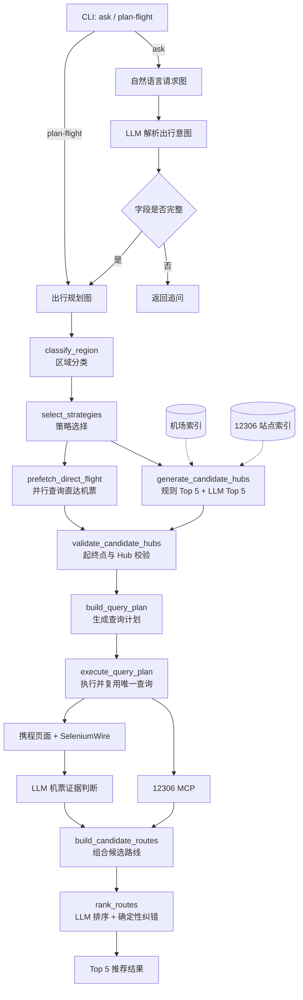

# Flight Watch Agent

Flight Watch Agent 是一个基于 LangGraph 的实时综合出行规划 Agent。用户可以使用自然语言或结构化参数输入出发地、目的地、日期、时间偏好和预算，系统会查询火车与机票，并比较直达和两段式组合路线。

## 主要功能

- 使用 LLM 解析自然语言出行需求。
- 通过 `12306-mcp` 查询火车车次、余票和票价。
- 通过携程公开页面和 SeleniumWire 获取机票信息，不依赖官方机票 API。
- 支持直达、火车加飞机、飞机加火车、火车加火车、飞机加飞机路线。
- 使用规则与 LLM 共同生成中转 Hub，并通过本地机场和火车站索引校验。
- 综合价格、总耗时、航段数、换乘时间和用户偏好输出 Top 5。

## 系统架构



项目包含两个 LangGraph：

- **自然语言请求图**：解析 `ask` 输入，检查必填字段并决定追问或进入规划。
- **出行规划图**：选择策略、生成 Hub、执行查询、组合路线并完成排序。

## 路线策略

当前支持六种策略：

| 策略 | 含义 |
| --- | --- |
| `direct_flight` | 机票直达查询，结果可能是航司联程产品 |
| `direct_train` | 直达火车 |
| `train_flight` | 火车后转飞机 |
| `flight_train` | 飞机后转火车 |
| `train_train` | 两段火车 |
| `flight_flight` | 两张独立机票组合 |

组合搜索目前限制为两条查询边。携程返回的一张联程机票可能包含多个物理航班，因此 `Flight A+B` 表示一个含中转的机票产品，并非真正直飞。

## 环境安装

要求：

- Python 3.11+
- Node.js LTS，以及可用的 `node`、`npm`、`npx`
- Microsoft Edge 或 Chrome

```powershell
python -m venv agent_env
.\agent_env\Scripts\Activate.ps1
python -m pip install -e ".[dev,ctrip]"
```

火车查询默认启动：

```powershell
npx -y 12306-mcp
```

## 配置

复制配置模板：

```powershell
Copy-Item .env.example .env
```

常用配置：

```dotenv
OPENAI_API_KEY=your-api-key
FLIGHT_WATCH_LLM_MODEL=openai:gpt-4.1-mini
FLIGHT_WATCH_FAST_LLM_MODEL=openai:gpt-4.1-mini
FLIGHT_WATCH_ROUTE_LLM_MODEL=

FLIGHT_WATCH_12306_MCP_COMMAND=
FLIGHT_WATCH_12306_MCP_ARGS=

FLIGHT_WATCH_CTRIP_BROWSER=edge
FLIGHT_WATCH_CTRIP_HEADLESS=false
FLIGHT_WATCH_CTRIP_LOGIN_ALLOWED=true
FLIGHT_WATCH_CTRIP_USERNAME=
FLIGHT_WATCH_CTRIP_PASSWORD=
FLIGHT_WATCH_CTRIP_COOKIES_FILE=data/ctrip_cookies.json
FLIGHT_WATCH_CTRIP_MANUAL_VERIFICATION_WAIT_SECONDS=120
FLIGHT_WATCH_CTRIP_REUSE_BROWSER=true
```

模型分工：

- `FLIGHT_WATCH_LLM_MODEL`：基础模型。
- `FLIGHT_WATCH_FAST_LLM_MODEL`：意图解析、Hub 规划、机票证据判断和默认路线排序。
- `FLIGHT_WATCH_ROUTE_LLM_MODEL`：可选的独立路线排序模型；留空时使用快速模型。

携程出现人工验证码时，需要使用非无头浏览器，并设置足够的人工验证等待时间。登录成功后的 Cookie 会保存到 `FLIGHT_WATCH_CTRIP_COOKIES_FILE`。

系统环境变量优先于 `.env`。可以通过 `FLIGHT_WATCH_ENV_FILE` 指定其他配置文件。

## 快速使用

激活虚拟环境后，可以直接使用 `flight-watch`；下面的命令也适用于未激活环境。

### 自然语言规划

```powershell
.\agent_env\Scripts\flight-watch.exe ask `
  "帮我查一下 2026-08-15 成都到新加坡，上午出发，预算 3000 以内的方案"
```

只查询机票：

```powershell
.\agent_env\Scripts\flight-watch.exe ask `
  "帮我查一下 2026-08-15 成都到新加坡的方案" `
  --flight-only
```

### 结构化参数规划

```powershell
.\agent_env\Scripts\flight-watch.exe plan-flight `
  --origin CTU `
  --destination SIN `
  --travel-date 2026-08-15 `
  --time-preference morning `
  --budget 3000 `
  --currency CNY
```

`ask` 和 `plan-flight` 默认在标准错误流显示运行进度。使用 `--quiet` 可关闭进度，使用 `--show-flight-raw` 可附加输出机票搜索状态。

### 单独调试机票搜索

```powershell
.\agent_env\Scripts\flight-watch.exe debug-flight-search `
  --origin CTU `
  --destination SIN `
  --travel-date 2026-08-15 `
  --max-iterations 1
```

添加 `--no-llm-judge` 可以跳过 LLM 证据判断，仅检查页面抓取与结构化解析。

## 数据与排序

本地地点索引：

- `resources/station_name.js`：12306 火车站名称与 telecode。
- `resources/airports_normalized_with_flight_potential.csv`：机场、城市、IATA、机场等级和航班潜力。
- `resources/airports.csv`、`resources/airports.json`：机场索引补充数据。

国际路线的规则 Hub 默认选择 `T1/T2` 且 `flight_potential_score >= 0.50` 的机场城市。系统生成规则候选 Top 5 和 LLM 候选 Top 5，随后过滤起终点同城 Hub 和无法通过本地索引校验的地点。

最终排序分为两步：LLM 根据总价、门到门耗时、实际航段数、换乘等待和用户偏好排序；确定性规则随后纠正明显反常的顺序。如果路线 A 同时不比路线 B 更贵、更慢或更复杂，并至少有一项严格更优，A 必须排在 B 前面。

## 测试

```powershell
.\agent_env\Scripts\python.exe -m pytest -q
```

