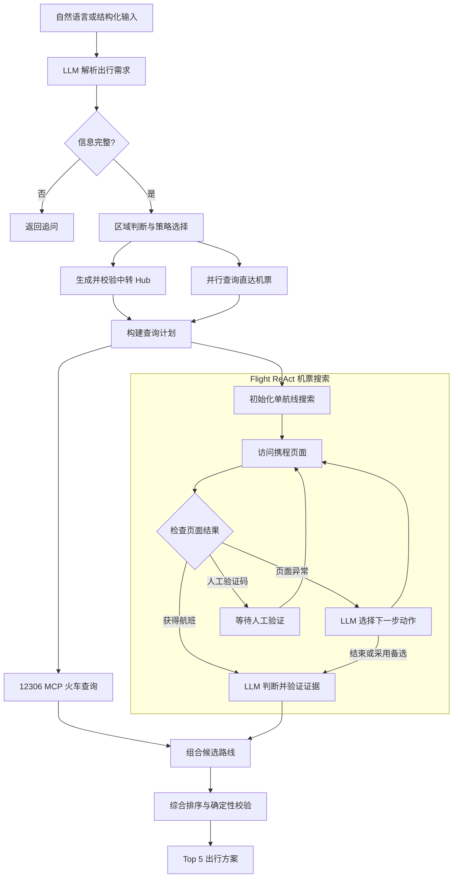

# Flight Watch Agent

Flight Watch Agent 是一个基于 LangGraph 的综合出行规划 Agent。它能够理解自然语言需求，查询火车与机票，并比较直达及中转组合，给出兼顾价格、时间和换乘体验的出行建议。

## 功能

- 自然语言解析出发地、目的地、日期、时间偏好和预算。
- 通过 `12306-mcp` 查询火车车次、余票和票价。
- 通过携程公开页面获取机票信息，不依赖官方机票 API。
- 支持直达火车、机票，以及火车和飞机的两段式组合。
- 结合本地机场、火车站索引与 LLM 生成中转城市。
- 对候选路线进行可行性检查和综合排序，输出 Top 5。
- 携程出现验证码时支持人工完成验证后继续运行。

## 系统流程



系统可组合以下路线：

- 直达飞机或直达火车
- 火车 + 飞机
- 飞机 + 火车
- 火车 + 火车
- 飞机 + 飞机

## 环境要求

- Python 3.11+
- Node.js LTS，且 `node`、`npm`、`npx` 可用
- Microsoft Edge 或 Chrome

```powershell
python -m venv agent_env
.\agent_env\Scripts\Activate.ps1
python -m pip install -e ".[dev,ctrip]"
```

火车查询默认使用：

```powershell
npx -y 12306-mcp
```

## 配置

```powershell
Copy-Item .env.example .env
```

常用配置：

```dotenv
OPENAI_API_KEY=your-api-key
FLIGHT_WATCH_LLM_MODEL=openai:gpt-4.1-mini
FLIGHT_WATCH_FAST_LLM_MODEL=openai:gpt-4.1-mini
FLIGHT_WATCH_ROUTE_LLM_MODEL=

FLIGHT_WATCH_12306_MCP_COMMAND=
FLIGHT_WATCH_12306_MCP_ARGS=

FLIGHT_WATCH_CTRIP_BROWSER=edge
FLIGHT_WATCH_CTRIP_HEADLESS=false
FLIGHT_WATCH_CTRIP_LOGIN_ALLOWED=true
FLIGHT_WATCH_CTRIP_USERNAME=
FLIGHT_WATCH_CTRIP_PASSWORD=
FLIGHT_WATCH_CTRIP_COOKIES_FILE=data/ctrip_cookies.json
FLIGHT_WATCH_CTRIP_REUSE_BROWSER=true
```

程序默认读取项目根目录的 `.env`，系统环境变量优先。需要人工处理携程验证码时，应使用非无头浏览器。

## 领域查询工具

规划图通过两个稳定的领域工具访问外部数据：

- `FlightSearchTool`：接收 `FlightSearchRequest`，返回 `ToolResult[FlightSearchOutput]`。
- `TrainSearchTool`：接收 `TrainSearchRequest`，返回 `ToolResult[TrainSearchOutput]`。

工具提供单次 `search()` 和批量 `search_many()` 接口。批量接口保持输入顺序、自动消除重复请求，并复用线程安全的 TTL/LRU 内存缓存。默认缓存 300 秒、最多 512 条；错误和需要人工操作的结果不会缓存。

```python
from datetime import date

from flight_watch_agent.app import build_default_flight_query_tool
from flight_watch_agent.travel_tools import FlightSearchRequest

tool = build_default_flight_query_tool()
result = tool.search(
    FlightSearchRequest(
        origin="CTU",
        destination="CJU",
        travel_date=date(2026, 7, 31),
    )
)
if result.ok and result.data:
    print(result.data.options)
elif result.error:
    print(result.error.code, result.error.retryable, result.error.message)
```

统一状态为 `success`、`no_results`、`human_action_required` 和 `error`。错误码包括：

```text
invalid_input, timeout, captcha_required, login_required, rate_limited,
route_mismatch, parse_failed, tool_unavailable, internal_error
```

每个结果同时返回 `request_id`、耗时、缓存命中、尝试次数和后端名称。可通过以下配置调整缓存：

```dotenv
FLIGHT_WATCH_TOOL_CACHE_TTL_SECONDS=300
FLIGHT_WATCH_TOOL_CACHE_MAX_ENTRIES=512
FLIGHT_WATCH_TOOL_CACHE_NO_RESULTS=true
```

需要注册给 LangChain Agent 时，可直接使用：

```python
from flight_watch_agent.app import build_default_agent_tools

tools = build_default_agent_tools()
# names: search_flights, search_trains
```

Agent 适配器只返回精简、可序列化的公开字段，不暴露浏览器状态或原始抓包。

### 路线正确性边界

- 查询地点会保留原始输入，并分别解析为城市、实际机场或火车站。城市代码（如 `BJS`）可以匹配 `PEK/PKX`，明确指定 `PEK` 时不会接受 `PKX` 证据。
- 机票结果同时返回 `requested_origin/requested_destination` 与 `actual_origin/actual_destination`，展示和组合路线使用证据中的实际机场。
- 内部行程时间均为带时区的绝对 `datetime`。用户日期表示首段在出发地的本地出发日期；跨日和跨时区计算不再只比较 `"HH:MM"`。
- 火车转飞机、飞机转火车和同城跨机场必须存在地面接驳证据。接驳边包含耗时、缓冲、费用、来源和可靠性；没有接驳证据的跨城组合不会成为候选路线。
- 当前地面接驳数据是保守的内置估算，最终下单前仍应核验实时交通情况。
- 候选路线在评分和排序前统一经过确定性可行性引擎。引擎校验实际端点连通、带时区的绝对时间顺序、地面接驳以及国内/国际、同机场/跨机场、火车转飞机等不同换乘缓冲。
- 可行性结果分为 `feasible`、`infeasible` 和 `uncertain`，并附带结构化原因及可用/必需换乘分钟数。`infeasible` 不进入 Top 5；`uncertain` 会在推荐文本中标出风险代码。

## 使用

### 自然语言规划

```powershell
.\agent_env\Scripts\flight-watch.exe ask `
  "帮我查一下 2026-08-15 成都到新加坡，上午出发，预算 3000 以内的方案"
```

仅查询机票：

```powershell
.\agent_env\Scripts\flight-watch.exe ask `
  "帮我查一下 2026-08-15 成都到新加坡的方案" `
  --flight-only
```

### 结构化参数规划

```powershell
.\agent_env\Scripts\flight-watch.exe plan-flight `
  --origin CTU `
  --destination SIN `
  --travel-date 2026-08-15 `
  --time-preference morning `
  --budget 3000 `
  --currency CNY
```

### 调试机票搜索

```powershell
.\agent_env\Scripts\flight-watch.exe debug-flight-search `
  --origin CTU `
  --destination SIN `
  --travel-date 2026-08-15
```

`ask` 和 `plan-flight` 支持 `--quiet` 关闭进度提示，也可以使用 `--show-flight-raw` 查看机票搜索状态。`debug-flight-search` 支持 `--no-llm-judge` 跳过 LLM 证据判断。

## 本地数据

- `resources/station_name.js`：12306 火车站名称与代码。
- `resources/airports_normalized_with_flight_potential.csv`：机场、城市、IATA 和航班潜力。
- `resources/airports.csv`、`resources/airports.json`：机场索引补充数据。

## 测试

```powershell
.\agent_env\Scripts\python.exe -m pytest -q
```

## 当前限制

- 携程页面、登录风控和验证码变化可能影响机票抓取。
- 12306 只能查询预售期内的日期。
- 地面接驳目前使用保守的静态估算，尚未接入实时路况和动态费用。
- 当前只支持直达和两段式路线。
- 页面票价是查询时的公开价格，不保证最终可购。
