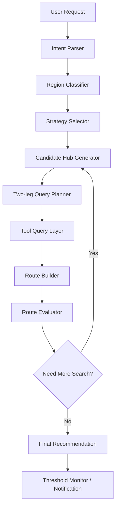

# Two-leg Multimodal Travel Agent 设计指导文档

## 1. 目标概述

本系统目标是构建一个基于 LangGraph 的出行方式查询 Agent。系统需要在用户给定出发地、目的地、日期、预算和偏好后，自动比较多种两段式出行策略，并综合判断哪种方案最具性价比。

当前 MVP 阶段的核心约束是：

1. **最多只考虑两段主行程**。
2. **火车票只使用 12306 MCP 查询，因此只支持中国境内火车段**。
3. **机票价格通过页面搜索 / Web Search 工具查询**。
4. **不考虑境外火车数据**。
5. **市内换乘不计入“两段主行程”，但必须计入总耗时、总价格和风险评估**。
6. **最终目标不是单纯找最低价，而是综合比较价格、耗时、换乘复杂度、风险和用户偏好。**

可以将系统定义为：

> Two-leg multimodal route optimization with domestic-train-only constraint.

中文解释是：

> 系统将出行方案限制为最多两段主行程，并且所有火车段必须是中国境内 12306 可查询路线。系统首先根据起点和终点是否位于中国境内选择可用策略，包括直飞、直达火车、火车转飞机、飞机转火车、火车转火车和飞机转飞机。随后由 LLM 生成候选中转城市或车站，工具层查询对应火车票和机票价格，系统构建两段候选路线并计算总价、总耗时、换乘成本和风险。最终由评估器在不同策略之间比较性价比，输出最便宜、最推荐和最省事的方案。

---

## 2. 核心问题抽象

用户关心的并不是单一交通工具，而是“全程综合性价比”。例如：

- 南京到新加坡，直飞可能很贵；先坐火车到上海、杭州或广州，再飞新加坡可能更便宜。
- 新加坡到大理，直飞或中转机票可能较贵；先飞昆明或成都，再坐火车到大理可能更划算。
- 成都到大理，直达票价或可用性不佳时，通过广通北、昆明等站中转可能更便宜。

因此系统本质上是在求解一个简化版的多模态路径搜索问题：

```text
origin → destination
origin → hub → destination
```

其中每条边可能是：

```text
train edge
flight edge
local transfer edge
```

但当前 MVP 限制为：

```text
major legs ≤ 2
train edge must be domestic China train edge
```

---

## 3. 为什么当前阶段不做完整图搜索

完整的多模态图搜索可以支持任意多段路线，例如：

```text
火车 → 飞机 → 火车 → 飞机
```

但在当前阶段不建议直接做复杂图搜索，原因是：

1. **工具查询成本高**：每一个候选边都需要调用 12306 MCP 或页面搜索工具。
2. **机票页面搜索不稳定**：搜索结果可能存在价格摘要、历史价格、动态页面等问题。
3. **多跳组合会导致组合爆炸**：候选城市越多，边查询数量会快速增长。
4. **用户当前主要场景可以由两段行程覆盖**。
5. **MVP 需要先保证稳定性、可解释性和可调试性**。

因此建议第一版采用“两段主行程 + 策略约束 + 候选 hub 生成”的架构。

---

## 4. 系统支持的出行策略

当前系统支持以下 6 类策略。

### 4.1 direct_flight：飞机直达

适用场景：

```text
南京 → 新加坡
新加坡 → 成都
成都 → 曼谷
```

查询方式：

```text
origin airport(s) → destination airport(s)
```

特点：

- 最省事；
- 换乘风险最低；
- 价格可能较高；
- 适合作为 baseline。

---

### 4.2 direct_train：火车直达

适用场景：

```text
成都 → 大理
南京 → 上海
广州 → 深圳
```

限制：

```text
origin 和 destination 必须都在中国境内。
```

查询方式：

```text
origin station(s) → destination station(s)
```

特点：

- 只使用 12306 MCP；
- 价格和余票可信度高；
- 对中国境内中短途路线很重要；
- 对境外目的地不启用。

---

### 4.3 train_flight：火车 → 飞机

适用场景：

```text
南京 → 上海 → 新加坡
苏州 → 杭州 → 曼谷
常州 → 上海 → 东京
```

限制：

```text
第一段 train 必须是中国境内火车；
hub 必须在中国境内；
第二段 flight 可以是国内或国际航班。
```

典型结构：

```text
origin city/station
  → hub train station
  → hub airport
  → destination airport/city
```

注意：

```text
hub train station → hub airport 是市内换乘，不计入 major leg，但计入成本和风险。
```

特点：

- 是“中国城市出发去境外”时最重要的低价策略；
- 适合寻找附近大机场城市；
- 风险主要来自火车到达时间与航班起飞时间之间的衔接。

---

### 4.4 flight_train：飞机 → 火车

适用场景：

```text
新加坡 → 昆明 → 大理
新加坡 → 成都 → 绵阳
曼谷 → 广州 → 深圳
```

限制：

```text
第二段 train 必须是中国境内火车；
hub 和 destination 必须在中国境内。
```

典型结构：

```text
origin airport/city
  → hub airport
  → hub train station
  → destination station/city
```

注意：

```text
hub airport → hub train station 是市内换乘，不计入 major leg，但计入成本和风险。
```

特点：

- 适合“境外到中国小城市”或“中国境内机场覆盖较弱城市”；
- 风险主要来自航班延误导致赶不上后续火车。

---

### 4.5 train_train：火车 → 火车

适用场景：

```text
成都 → 广通北 → 大理
成都 → 昆明 → 大理
北京 → 郑州 → 洛阳
```

限制：

```text
origin、hub、destination 都必须在中国境内；
两段都必须能由 12306 MCP 查询。
```

特点：

- 适合中国境内路线；
- 可能发现直达之外的更便宜组合；
- 风险主要来自换乘时间是否充足、是否同站换乘。

---

### 4.6 flight_flight：飞机 → 飞机

适用场景：

```text
南京 → 广州 → 新加坡
成都 → 香港 → 新加坡
新加坡 → 广州 → 成都
```

限制：

```text
无火车限制。
```

特点：

- 可用于跨境长距离路线；
- 可能找到比直飞更便宜的中转票；
- 风险需要考虑是否联程、是否重新托运行李、是否需要入境或签证。

---

## 5. 策略启用规则

系统需要先判断 origin 和 destination 是否在中国境内。根据判断结果启用不同策略。

### 5.1 起点中国，终点境外

例如：

```text
南京 → 新加坡
成都 → 东京
武汉 → 曼谷
```

启用：

```text
direct_flight
train_flight
flight_flight
```

禁用：

```text
direct_train
flight_train
train_train
```

原因：

- 境外没有火车数据；
- 火车只能作为中国境内出发前置段；
- 核心策略是“先到中国境内大机场城市，再飞出境”。

---

### 5.2 起点境外，终点中国

例如：

```text
新加坡 → 大理
曼谷 → 绵阳
东京 → 成都
```

启用：

```text
direct_flight
flight_train
flight_flight
```

禁用：

```text
direct_train
train_flight
train_train
```

原因：

- 境外没有火车数据；
- 火车只能作为进入中国之后的后置段；
- 核心策略是“先飞到中国境内枢纽城市，再坐火车到最终目的地”。

---

### 5.3 起点中国，终点中国

例如：

```text
成都 → 大理
南京 → 广州
北京 → 西双版纳
```

启用：

```text
direct_train
direct_flight
train_train
train_flight
flight_train
flight_flight
```

说明：

- 所有策略理论上都可用；
- 但可以按距离、机场条件、高铁便利性排序优先级；
- 中短途优先查火车；
- 长距离或目的地机场强的路线优先查飞机。

---

### 5.4 起点境外，终点境外

例如：

```text
新加坡 → 东京
曼谷 → 首尔
```

启用：

```text
direct_flight
flight_flight
```

禁用所有包含 train 的策略。

原因：

```text
当前系统没有境外火车数据。
```

---

## 6. Agent 层整体架构

推荐使用 LangGraph 的显式工作流，而不是让一个 ReAct Agent 完全自由决策。

整体流程如下：



每个节点职责如下：

| 节点 | 职责 | 是否需要 LLM |
|---|---|---|
| Intent Parser | 解析用户请求 | 是 |
| Region Classifier | 判断起终点是否在中国境内 | 可以规则化 |
| Strategy Selector | 选择可用策略 | 是 + 规则 |
| Candidate Hub Generator | 生成候选中转城市/站点/机场 | 是 |
| Two-leg Query Planner | 决定查哪些边 | 是 + 预算控制 |
| Tool Query Layer | 调用 12306 MCP 和机票页面搜索 | 否，工具执行 |
| Route Builder | 构造候选路线对象 | 否，程序逻辑 |
| Route Evaluator | 综合评分和排序 | 程序评分 + LLM解释 |
| Need More Search | 判断是否继续扩展 | 规则 + LLM |
| Final Recommendation | 生成用户可读推荐 | 是 |
| Threshold Monitor | 低价触发通知 | 规则化 |

---

## 7. State 设计

LangGraph 中建议维护一个统一状态对象。下面是概念设计，不是具体代码。

```text
TravelAgentState
├── user_request
├── parsed_intent
├── region_info
├── enabled_strategies
├── candidate_hubs
├── query_plan
├── raw_tool_results
├── normalized_edges
├── candidate_routes
├── ranked_routes
├── search_budget
├── threshold_info
├── notification_decision
└── final_response
```

### 7.1 parsed_intent

包含用户需求：

```json
{
  "origin": "南京",
  "destination": "新加坡",
  "date": "2026-07-09",
  "return_date": null,
  "passengers": 1,
  "priority": "cost_first",
  "max_legs": 2,
  "allowed_modes": ["train", "flight"],
  "currency": "CNY",
  "constraints": {
    "avoid_overnight": false,
    "need_checked_baggage": false,
    "max_total_duration_hours": null,
    "max_transfer_count": 1
  }
}
```

### 7.2 region_info

判断起终点区域：

```json
{
  "origin_country": "China",
  "destination_country": "Singapore",
  "origin_is_china": true,
  "destination_is_china": false,
  "route_type": "china_to_abroad"
}
```

### 7.3 enabled_strategies

例如南京到新加坡：

```json
{
  "enabled": ["direct_flight", "train_flight", "flight_flight"],
  "disabled": {
    "direct_train": "destination is outside China",
    "flight_train": "destination train segment would be outside China",
    "train_train": "destination is outside China"
  }
}
```

### 7.4 candidate_hubs

```json
[
  {
    "city": "上海",
    "hub_type": "train_flight_hub",
    "train_stations": ["上海虹桥"],
    "airports": ["PVG", "SHA"],
    "reason": "南京到上海高铁密集，上海到新加坡航班多",
    "priority": 0.95
  },
  {
    "city": "杭州",
    "hub_type": "train_flight_hub",
    "train_stations": ["杭州东"],
    "airports": ["HGH"],
    "reason": "南京到杭州高铁方便，杭州有国际机场",
    "priority": 0.80
  }
]
```

### 7.5 normalized_edges

统一火车、飞机、市内换乘边：

```json
{
  "edge_id": "train_NanjingSouth_ShanghaiHongqiao_20260709_G123",
  "mode": "train",
  "from": "南京南",
  "to": "上海虹桥",
  "departure_time": "2026-07-09T08:20:00+08:00",
  "arrival_time": "2026-07-09T09:30:00+08:00",
  "duration_minutes": 70,
  "price": 139,
  "currency": "CNY",
  "availability": "available",
  "source": "12306_mcp",
  "confidence": 0.95
}
```

### 7.6 candidate_routes

```json
{
  "route_id": "route_train_flight_nanjing_shanghai_singapore_001",
  "strategy": "train_flight",
  "major_legs": [
    "train_NanjingSouth_ShanghaiHongqiao_20260709_G123",
    "flight_PVG_SIN_20260709_xxx"
  ],
  "transfer_legs": [
    "transfer_ShanghaiHongqiao_PVG"
  ],
  "total_price": 1069,
  "currency": "CNY",
  "total_duration_minutes": 600,
  "transfer_count": 1,
  "risk_score": 0.35,
  "confidence": 0.78,
  "score": 0.23
}
```

---

## 8. 候选 Hub 生成逻辑

Hub 生成是整个系统的关键，因为最多两段行程意味着只有一个中转点。Hub 质量直接决定系统能否发现便宜路线。

### 8.1 train_flight 的 Hub 生成

适用于：中国出发、境外到达，或中国境内需要先到机场城市的情况。

Hub 必须满足：

```text
1. 位于中国境内；
2. 从 origin 有可查询的 12306 火车路线；
3. 拥有可查询的机场；
4. 从 hub airport 到 destination 可能有机票。
```

优先选择：

```text
1. 距离起点较近的高铁枢纽；
2. 国际航班丰富的机场城市；
3. 到目的地航线较多的城市；
4. 火车站到机场换乘可接受的城市。
```

示例：南京 → 新加坡

优先 hub：

```text
上海、杭州、广州、深圳、厦门、福州
```

原因：

```text
南京到这些城市有高铁或动车连接；
这些城市机场可能存在飞新加坡的低价航班；
上海、广州、深圳属于国际航班强枢纽。
```

---

### 8.2 flight_train 的 Hub 生成

适用于：境外出发、中国境内到达，或先飞到大城市再坐火车到目的地。

Hub 必须满足：

```text
1. 位于中国境内；
2. 拥有机场；
3. 从 hub 到 destination 有 12306 火车路线；
4. hub airport 到 hub train station 换乘可接受。
```

示例：新加坡 → 大理

候选 hub：

```text
昆明、成都、重庆、广州、深圳、贵阳
```

其中昆明优先级通常较高，因为：

```text
昆明距离大理近；
昆明到大理火车较成熟；
新加坡到昆明可能存在可用航班。
```

---

### 8.3 train_train 的 Hub 生成

适用于：中国境内起点到中国境内终点。

Hub 必须满足：

```text
1. 位于中国境内；
2. origin → hub 和 hub → destination 都能由 12306 查询；
3. 中转时间和方向合理；
4. 不选择明显绕路过大的站点。
```

示例：成都 → 大理

候选 hub：

```text
广通北、昆明、楚雄、攀枝花
```

这里要允许 LLM 生成一些“非显然中转站”，例如广通北，因为某些铁路路线中这些站点可能带来低价组合。

---

### 8.4 flight_flight 的 Hub 生成

适用于所有有机票查询能力的路线。

Hub 可以是国内或境外机场城市，但需要考虑：

```text
1. 是否有可查询机票；
2. 是否涉及复杂签证或入境；
3. 中转时间是否可接受；
```

示例：南京 → 新加坡

候选 hub：

```text
广州、深圳、香港、厦门、上海、北京、成都、重庆
```

但 MVP 阶段建议限制 hub 数量，避免机票页面搜索爆炸。

---

## 9. 查询计划设计

Two-leg Query Planner 的职责是把策略和 hub 转换为具体工具调用计划。

### 9.1 查询计划的基本原则

1. **先查 direct baseline**：直飞或直达火车是比较基准。
2. **再查高优先级 hub**：优先查最可能便宜的 3-5 个 hub。
3. **每个 hub 最多生成两条 major leg 查询**。
4. **市内换乘用估算，不调用票务工具**。
5. **设置查询预算，防止组合爆炸**。

建议默认预算：

```text
max_hubs_per_strategy = 5
max_flight_queries = 10
max_train_queries = 10
max_total_routes = 30
```

---

### 9.2 南京 → 新加坡示例

启用策略：

```text
direct_flight
train_flight
flight_flight
```

查询计划：

```text
direct_flight:
  NKG → SIN

train_flight:
  南京南 → 上海虹桥
  PVG/SHA → SIN

  南京南 → 杭州东
  HGH → SIN

  南京南 → 广州南
  CAN → SIN

  南京南 → 深圳北
  SZX → SIN

flight_flight:
  NKG → CAN
  CAN → SIN

  NKG → XMN
  XMN → SIN
```

同时估算：

```text
上海虹桥站 → 浦东机场
杭州东站 → 萧山机场
广州南站 → 白云机场
深圳北站 → 宝安机场
```

---

### 9.3 新加坡 → 大理示例

启用策略：

```text
direct_flight
flight_train
flight_flight
```

查询计划：

```text
direct_flight:
  SIN → DLU

flight_train:
  SIN → KMG
  昆明/昆明南 → 大理

  SIN → TFU/CTU
  成都东 → 大理

  SIN → CKG
  重庆西/重庆北 → 大理

flight_flight:
  SIN → KMG
  KMG → DLU

  SIN → CAN
  CAN → DLU
```

同时估算：

```text
昆明长水机场 → 昆明站/昆明南站
成都天府机场 → 成都东站
重庆江北机场 → 重庆北/重庆西站
```

---

### 9.4 成都 → 大理示例

启用策略：

```text
direct_train
direct_flight
train_train
train_flight
flight_train
flight_flight
```

但可以优先：

```text
direct_train
train_train
direct_flight
```

查询计划：

```text
direct_train:
  成都东 → 大理

train_train:
  成都东 → 广通北
  广通北 → 大理

  成都东 → 昆明
  昆明 → 大理

  成都东 → 楚雄
  楚雄 → 大理

direct_flight:
  TFU/CTU → DLU
```

如果直达火车和 train_train 已经找到很便宜方案，可以不继续查 train_flight / flight_train / flight_flight。

---

## 10. 市内换乘建模

市内换乘不是 major leg，但必须进入评分。

例如 train_flight：

```text
南京南 → 上海虹桥      major leg 1: train
上海虹桥 → 上海浦东    transfer leg: local transfer
上海浦东 → 新加坡      major leg 2: flight
```

transfer leg 需要包含：

```text
estimated_price
estimated_duration_minutes
risk_level
same_city
same_station_or_terminal
```

如果没有精确地铁/打车数据，可以先使用规则估算：

```text
same_station transfer: 0-15 min, low risk
same_city train station to airport: 60-120 min, medium risk
cross-city transfer: usually not allowed in MVP unless explicitly selected
```

示例：

```json
{
  "mode": "local_transfer",
  "from": "上海虹桥站",
  "to": "上海浦东机场",
  "estimated_price": 30,
  "currency": "CNY",
  "estimated_duration_minutes": 90,
  "risk_score": 0.35,
  "note": "需要从虹桥跨城前往浦东，建议预留至少 3-4 小时。"
}
```

---

## 11. 时间衔接规则

两段行程不能只比较价格，还要保证时间可执行。

### 11.1 train_flight 衔接

火车到达 hub 后，需要足够时间去机场并办理登机。

建议规则：

```text
国内航班：火车到达 → 航班起飞 至少 3 小时
国际航班：火车到达 → 航班起飞 至少 4 小时
如果火车站到机场换乘超过 90 分钟，则再加 30-60 分钟缓冲
```

如果小于最小衔接时间：

```text
路线标记为 high risk
```

---

### 11.2 flight_train 衔接

航班到达 hub 后，需要考虑延误、出关、取行李、前往火车站。

建议规则：

```text
国内航班到达 → 火车出发 至少 2.5 小时
国际航班到达 → 火车出发 至少 4 小时
如果需要入境/取行李/跨城换乘，则增加风险惩罚
```

---

### 11.3 train_train 衔接

火车换火车需要判断是否同站。

建议规则：

```text
同站换乘：至少 30 分钟
不同站换乘：至少 2 小时
夜间换乘：增加风险惩罚
```

---

### 11.4 flight_flight 衔接

如果是非联程航班，需要更长中转时间。

建议规则：

```text
同一机场、联程：至少 1.5-2 小时
同一机场、非联程：至少 3-4 小时
不同机场：通常不推荐，除非用户明确接受
国际中转涉及入境：增加高风险惩罚
```

由于页面搜索很难判断是否联程，MVP 中可以默认：

```text
flight_flight 组合按非联程处理，风险偏高。
```

---


---

## 12. 路线评分设计

最终推荐不能只看 total_price。建议使用综合评分函数。

```text
route_score =
    price_weight * normalized_total_price
  + duration_weight * normalized_total_duration
  + transfer_weight * transfer_complexity
  + risk_weight * risk_score
  - confidence_weight * confidence
```

分数越低越好。

### 12.1 默认价格优先权重

```text
price_weight = 0.60
duration_weight = 0.15
transfer_weight = 0.10
risk_weight = 0.10
confidence_weight = 0.05
```

适合用户说：

```text
越便宜越好
找最低价
可以接受中转
```

### 12.2 稳妥优先权重

```text
price_weight = 0.35
duration_weight = 0.25
transfer_weight = 0.20
risk_weight = 0.15
confidence_weight = 0.05
```

适合用户说：

```text
不要太折腾
尽量稳妥
不想赶时间
```

### 12.3 时间优先权重

```text
price_weight = 0.25
duration_weight = 0.45
transfer_weight = 0.15
risk_weight = 0.10
confidence_weight = 0.05
```

适合用户说：

```text
尽量快
时间比价格重要
当天必须到
```

---

## 13. 风险评分设计

风险评分建议在 0 到 1 之间。

```text
0.0 - 0.2：低风险
0.2 - 0.5：中等风险
0.5 - 0.8：高风险
0.8 - 1.0：不推荐或应过滤
```

风险来源包括：

```text
1. 换乘时间不足；
2. 火车站到机场距离远；
3. 航班延误可能影响后续火车；
4. 机票价格来源置信度低；
5. 夜间换乘；
6. flight_flight 不是联程；
7. 需要跨机场或跨城市换乘；
8. 火车余票紧张；
9. 页面搜索结果没有明确行李信息。
```

不同策略的基础风险可设为：

| 策略 | 基础风险 |
|---|---:|
| direct_train | 0.10 |
| direct_flight | 0.15 |
| train_train | 0.20 |
| train_flight | 0.35 |
| flight_train | 0.40 |
| flight_flight | 0.45 |

说明：

- train_flight 需要避免误机，因此风险较高；
- flight_train 受航班延误影响，也较高；
- flight_flight 若不是联程，风险最高之一。

---

## 15. 搜索扩展与停止条件

由于系统是两段行程，搜索可以比较容易控制。

### 15.1 第一轮搜索

先查：

```text
1. direct baseline；
2. 每个启用策略下 top 3 hub；
3. 高置信、高可能低价路线。
```

### 15.2 第二轮扩展

仅在以下情况触发：

```text
1. 没有找到低于阈值的路线；
2. direct baseline 明显很贵；
3. 某个 hub 显示出明显低价潜力；
4. 用户明确要求“继续找更便宜的”；
5. 当前 top route 置信度太低，需要更多来源验证。
```

### 15.3 停止条件

```text
1. 已找到低于阈值且风险可接受的路线；
2. 查询预算用完；
3. 所有启用策略已查完；
4. 新增 hub 带来的预期节省不足；
5. 中转方案只比直达便宜很少，但耗时和风险明显增加。
```

示例规则：

```text
如果中转方案比直达便宜少于 10%，但多 4 小时以上或多一次高风险换乘，则不作为最推荐方案。
```

---

## 16. 通知逻辑

用户可能设置价格阈值，例如：

```text
南京到新加坡，总价低于 ¥1200 通知我。
```

通知不应该只看最低价格，还应该满足：

```text
1. total_price <= threshold；
2. route confidence >= minimum_confidence；
3. risk_score <= maximum_risk；
4. 不是重复通知；
5. 价格来源足够明确；
6. 如果机票价格置信度较低，需要先复核。
```

推荐阈值判断：

```text
Notify if:
  total_price <= user_threshold
  AND risk_score <= 0.55
  AND confidence >= 0.65
```

如果低价但风险高，通知应写成：

```text
发现一个低价候选方案，但存在较高中转风险，建议人工确认后再购买。
```

---

## 17. 最终输出格式

建议最终结果按用户决策方式组织，而不是只按分数排序。

### 17.1 推荐分类

输出至少包含：

```text
最推荐方案
最便宜方案
最省事方案
最快方案，可选
风险提示
需要确认的信息
```

### 17.2 示例输出

```text
最推荐方案：南京 → 上海 → 新加坡
策略：火车 + 飞机
总价：约 ¥1069
总耗时：约 10 小时
路线：南京南 → 上海虹桥，上海浦东 → 新加坡
推荐理由：比南京直飞便宜约 ¥1100，火车段短，上海到新加坡航班选择较多，整体性价比较高。
风险提示：需要从上海虹桥前往浦东机场，建议预留至少 4 小时。

最便宜方案：南京 → 广州 → 新加坡
策略：火车 + 飞机
总价：约 ¥980
不足：总耗时较长，绕行明显，适合极致低价优先用户。

最省事方案：南京 → 新加坡直飞
策略：飞机直达
总价：约 ¥2200
优点：无需中转，风险最低。
```

---

## 18. LLM Prompt 设计建议

### 18.1 Intent Parser Prompt

目标：只做结构化解析，不做推荐。

核心要求：

```text
从用户请求中提取 origin、destination、date、passengers、priority、budget、threshold、allowed_modes、max_legs。
如果用户没有明确说明，默认 max_legs=2，priority=cost_first。
不要臆造价格。
```

---

### 18.2 Strategy Selector Prompt

目标：根据区域和系统约束选择策略。

核心要求：

```text
你只能从 direct_flight、direct_train、train_flight、flight_train、train_train、flight_flight 中选择策略。
所有 train 段必须是中国境内 12306 可查询路线。
如果 origin 或 destination 在境外，不允许使用境外火车。
输出 enabled strategies 和 disabled reasons。
```

---

### 18.3 Candidate Hub Generator Prompt

目标：生成候选 hub，不查询价格。

核心要求：

```text
根据启用策略生成最多 N 个候选 hub。
每个 hub 必须给出 city、stations、airports、适用策略和选择理由。
优先选择高铁可达、机场航班丰富、换乘可接受的城市。
避免明显绕路和低可行性的 hub。
```

---

### 18.4 Query Planner Prompt

目标：把 hub 转成工具查询计划。

核心要求：

```text
为每个策略生成 major leg 查询。
最多两段 major legs。
市内换乘单独作为 transfer estimation，不计入 major legs。
遵守 max_train_queries 和 max_flight_queries。
不要重复查询等价路线。
```

---

### 18.5 Route Evaluator Prompt

目标：基于程序计算结果做解释。

核心要求：

```text
不要重新计算价格。
使用 route_score、total_price、total_duration、risk_score 和 confidence。
解释为什么推荐某条路线。
指出最便宜路线和最省事路线的差异。
明确提示价格需要最终确认。
```

---

## 19. 需要避免的错误

### 19.1 让 LLM 直接猜价格

错误做法：

```text
LLM 根据常识说“上海飞新加坡应该便宜”。
```

正确做法：

```text
LLM 只能决定查询上海这个 hub；最终价格必须来自工具。
```

---

### 19.2 把市内换乘当作第三段主行程

错误做法：

```text
南京南 → 上海虹桥 → 浦东机场 → 新加坡
被算作三段，导致 train_flight 被错误过滤。
```

正确做法：

```text
南京南 → 上海虹桥 是 major leg 1；
上海浦东 → 新加坡 是 major leg 2；
上海虹桥 → 浦东机场 是 transfer leg，不计入 max_legs。
```

---

### 19.3 对境外火车做查询

错误做法：

```text
新加坡境内火车 → 某机场
日本境内火车 → 东京机场
```

正确做法：

```text
当前 MVP 不查询任何境外火车。
```

---

### 19.4 只按价格排序

错误做法：

```text
总价最低就推荐。
```

正确做法：

```text
同时考虑耗时、换乘、风险和价格置信度。
```

---

### 19.5 忽略页面搜索价格的不确定性

错误做法：

```text
把搜索摘要价当作最终可购买价格。
```

正确做法：

```text
标记来源、查询时间、置信度，并提醒最终结算页确认。
```

---

## 20. MVP 开发路线

### Phase 1：基础策略和直达 baseline

实现：

```text
Intent Parser
Region Classifier
Strategy Selector
direct_flight 查询
direct_train 查询
基础输出
```

目标：

```text
能比较飞机直达和火车直达。
```

---

### Phase 2：加入两段策略

实现：

```text
train_flight
flight_train
train_train
flight_flight
Candidate Hub Generator
Two-leg Query Planner
Route Builder
```

目标：

```text
能发现南京→上海→新加坡、成都→广通北→大理等两段路线。
```

---

### Phase 3：加入综合评分

实现：

```text
route_score
risk_score
confidence
时间衔接检查
市内换乘估算
```

目标：

```text
不只是输出最低价，而是输出最推荐、最便宜、最省事方案。
```

---

---

## 21. 推荐的系统定位

当前阶段最合理的系统定位是：

> 一个由 LLM 引导候选 hub 和策略选择、由工具获取实时价格、由确定性评估器完成路线比较的两段式多模态出行规划 Agent。

可以概括为：

```text
LLM-guided two-leg multimodal route search.
```

更具体地说：

```text
LLM 负责理解用户需求、选择策略、生成候选中转城市和解释推荐理由；
工具层负责查询 12306 火车票和页面搜索机票价格；
程序层负责构建候选路线、检查两段约束、计算总价、评估风险和排序；
通知层负责在低于阈值且风险可接受时提醒用户。
```

这个设计既能覆盖你当前最关心的低价组合场景，又避免一开始陷入复杂多跳图搜索和境外交通数据问题。

